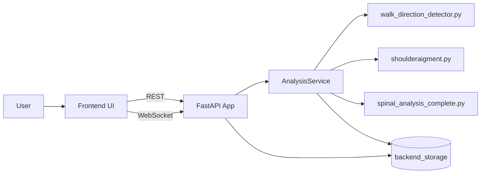
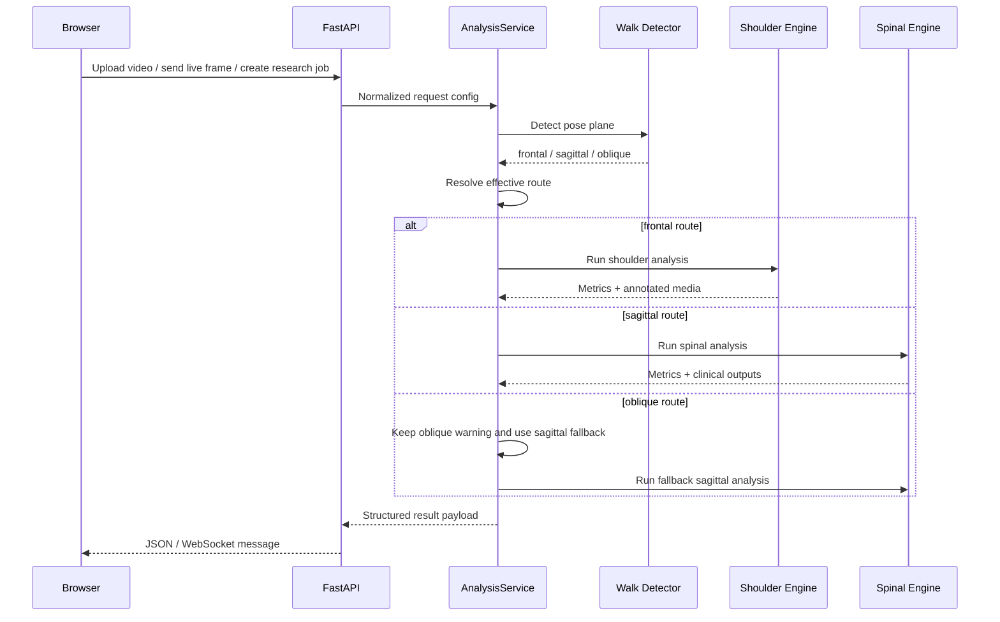

# Biomechanics Posture Analysis

Professional-grade video, live-camera, and batch biomechanics analysis for:

- Shoulder alignment in the frontal plane
- Sagittal spinal posture metrics including kyphosis, lordosis, and trunk lean
- Walk-direction and pose-plane classification (`frontal`, `sagittal`, `oblique`)
- Research-mode CSV batch processing with grouped summaries and exported results

The project combines a FastAPI backend, a motion-analysis frontend, and three core analysis engines:

- `shoulderaigment.py` for frontal shoulder metrics
- `spinal_analysis_complete.py` for sagittal spinal analysis
- `walk_direction_detector.py` for pose-plane detection and routing

## Table of Contents

- [Overview](#overview)
- [Key Features](#key-features)
- [Architecture](#architecture)
- [Project Structure](#project-structure)
- [Technology Stack](#technology-stack)
- [Analysis Pipeline](#analysis-pipeline)
- [How It Runs](#how-it-runs)
- [Installation](#installation)
- [Running the Application](#running-the-application)
- [Frontend Development Mode](#frontend-development-mode)
- [API Reference](#api-reference)
- [Generated Files and Outputs](#generated-files-and-outputs)
- [Configuration and Routing Rules](#configuration-and-routing-rules)
- [Current Implementation Notes](#current-implementation-notes)
- [Troubleshooting](#troubleshooting)
- [Legacy Script](#legacy-script)

## Overview

This repository is designed as a biomechanics analysis workspace with three user-facing workflows:

1. `Video Analysis`
   Upload a single video, detect the subject orientation, route the video to the correct analysis workflow, and export annotated artifacts.

2. `Live Mode`
   Stream frames from a webcam to the backend over WebSocket and receive live annotated posture analysis with route-aware metrics and thresholds.

3. `Researcher Mode`
   Upload a CSV that points to multiple videos, process each row, and generate per-video and per-state comparison outputs.

At runtime, the backend validates user configuration, decodes or saves the input media, routes the request based on selected and detected pose plane, invokes the relevant analysis modules, stores the generated assets in `backend_storage/`, and returns a structured JSON response to the frontend.

## Key Features

- FastAPI backend with REST and WebSocket endpoints
- Static frontend served directly by the backend
- Real-time live analysis over `/ws/live-analysis`
- Automatic pose-plane routing using walk-direction detection
- Oblique detection warning with sagittal fallback in live and upload routing
- Shoulder analysis with annotated video, CSV, summary, angle plots, and symmetry chart
- Spinal analysis with clinical report, time series, standard comparison chart, and optional annotated video
- Batch researcher workflow driven by CSV
- Themeable motion-analysis UI with animated background and live skeleton visualization

## Architecture



### Runtime Layers

- `backend/app/main.py`
  Web server, API routes, static file mounting, and WebSocket handling.

- `backend/app/analysis_service.py`
  The orchestration layer. It validates configuration, manages cached analyzers, performs routing, aggregates outputs, and writes manifests/results.

- `shoulderaigment.py`
  Frontal-plane shoulder alignment engine built around SpinePose keypoints.

- `spinal_analysis_complete.py`
  Sagittal spinal analysis pipeline with clinical comparisons and export utilities.

- `walk_direction_detector.py`
  Pose-plane classifier used to determine whether input is frontal, sagittal, or oblique.

- `frontend/`
  Motion-analysis UI, static HTML shell, JavaScript behavior, and styling.

### Request Flow



## Project Structure

```text
biomechanics posture analysis/
├── backend/
│   └── app/
│       ├── analysis_service.py      # orchestration, routing, exports
│       ├── main.py                  # FastAPI app and endpoints
│       └── __init__.py
├── backend_storage/
│   ├── results/                     # generated outputs and manifests
│   └── uploads/                     # uploaded source files
├── frontend/
│   ├── app.html                     # UI markup loaded by index.html
│   ├── index.html                   # entry page
│   ├── src/
│   │   ├── app.js                   # UI logic, live socket, charts, theming
│   │   ├── main.jsx                 # unused React scaffold file
│   │   └── styles.css               # UI styling
│   ├── package.json
│   ├── research-template.csv
│   └── vite.config.js
├── run_backend.py                   # convenience launcher for FastAPI
├── requirements.txt                # base Python requirements
├── shoulderaigment.py              # shoulder alignment analyzer
├── spinal_analysis_complete.py     # spinal curvature analysis pipeline
├── walk_direction_detector.py      # pose-plane classifier
├── realtime_analysis_server.py     # legacy Flask-based real-time server
└── README.md
```

## Technology Stack

### Backend

- Python
- FastAPI
- Uvicorn
- OpenCV
- NumPy
- MediaPipe
- SpinePose
- Matplotlib
- SciPy

### Frontend

- Static HTML + JavaScript + CSS
- Canvas-based custom charts and motion visualization
- Vite for local frontend tooling

### Important Note About the Frontend

The frontend package includes React-related dependencies and a `src/main.jsx` scaffold, but the active application is still the custom HTML/CSS/JavaScript interface driven by:

- `frontend/index.html`
- `frontend/app.html`
- `frontend/src/app.js`
- `frontend/src/styles.css`

For local all-in-one use, FastAPI can still serve the source frontend directly from `frontend/`.

For production split deployment, Vite builds the frontend into `frontend/dist/`, and the build step now copies the required static template assets into that output.

## Analysis Pipeline

### 1. Walk / Pose Plane Detection

Implemented in `walk_direction_detector.py`.

Responsibilities:

- classify posture orientation as `frontal`, `sagittal`, or `oblique`
- provide confidence scores
- support routing decisions in both upload and live workflows

### 2. Shoulder Alignment Analysis

Implemented in `shoulderaigment.py`.

Focus:

- frontal-plane shoulder tilt
- clavicle tilt
- shoulder height asymmetry
- trunk tilt and lateral shift

Typical outputs:

- annotated video
- `shoulder_angles.csv`
- `angle_plot.png`
- `summary.txt`
- `symmetry_bar_chart.png`

### 3. Spinal Curvature Analysis

Implemented in `spinal_analysis_complete.py`.

Focus:

- kyphosis
- lordosis
- trunk lean
- clinical comparison against published standards
- optional annotated video export

Typical outputs:

- clinical report object
- `time_series.png`
- `standard_comparison.png`
- optional `annotated_spinal.mp4`

### 4. Service Orchestration

Implemented in `backend/app/analysis_service.py`.

Responsibilities:

- validate incoming config
- decode live frames
- resize live frames for performance
- cache model objects
- route each request to the proper engine
- keep oblique warnings visible while applying sagittal fallback
- serialize results and return browser-ready URLs

## How It Runs

### Current Default Runtime

The simplest runtime path is:

1. Start the FastAPI backend with `python run_backend.py`
2. Open `http://127.0.0.1:8000`
3. Use the UI directly from the backend-served frontend files

### What Happens Internally

- FastAPI mounts `/files` to expose generated output artifacts from `backend_storage/`
- FastAPI can mount `/` to serve the static frontend from `frontend/` for local development
- Live mode sends frames to `/ws/live-analysis`
- Upload mode sends videos to `/api/analyze/video`
- Research mode creates background jobs through `/api/research/jobs`

## Installation

### Prerequisites

- Python 3.11 recommended
- Node.js 18+ recommended for frontend tooling
- A working webcam for live mode
- Access to the `spinepose` Python package for full shoulder/spinal functionality

### 1. Create a Python virtual environment

```powershell
python -m venv .venv
.venv\Scripts\Activate.ps1
```

### 2. Install Python dependencies

Start with the repository requirements:

```powershell
pip install -r requirements.txt
```

If you want to use the legacy Flask real-time server, install:

```powershell
pip install flask-sock
```

### 3. Install frontend dependencies

```powershell
cd frontend
npm install
cd ..
```

## Running the Application

### Recommended: Run the current FastAPI application

```powershell
python run_backend.py
```

Open:

```text
http://127.0.0.1:8000
```

This all-in-one local mode does not require Render, Vercel, or any paid deployment service. The backend serves the frontend directly, so you can develop and use the app entirely on your own machine.

### Make it online with Cloudflare Tunnel

If you want to share the app online without deploying it to Render, you can expose your local backend with Cloudflare Tunnel.

1. Install `cloudflared` from:
   `https://developers.cloudflare.com/cloudflare-one/connections/connect-networks/downloads/`
2. Run:

```powershell
.\start_online.ps1
```

3. Copy the public `trycloudflare.com` link shown in the terminal and open it in a browser.

Notes:

- Your computer must stay on while the public link is in use.
- Keep the tunnel window open or the link will stop working.
- The backend still runs locally on `http://127.0.0.1:8000`.
- Logs are written to `backend_stdout.log` and `backend_stderr.log`.

### Alternative: Run Uvicorn directly

```powershell
uvicorn backend.app.main:app --host 127.0.0.1 --port 8000
```

### Health Check

```text
GET http://127.0.0.1:8000/api/health
```

## Frontend Development Mode

For isolated frontend development:

```powershell
cd frontend
npm run dev
```

Vite is configured to proxy:

- `/api` to `http://127.0.0.1:8000`
- `/ws` to `ws://127.0.0.1:8000`
- `/files` to `http://127.0.0.1:8000`

So during development you should run both:

1. the FastAPI backend on port `8000`
2. the Vite dev server on port `5173`

If you use this split local mode, set:

```text
VITE_API_BASE_URL=http://127.0.0.1:8000
```

## Production Deployment

### Recommended topology

- Vercel hosts the frontend build
- Render hosts the FastAPI backend
- Render persistent disk stores `backend_storage/`

This split is the recommended production path because the backend depends on heavy Python CV/AI libraries and a live WebSocket analysis stream.

### No-Render option

If you do not want to use Render, you can skip the entire production deployment section and run the application locally:

1. Install Python dependencies with `pip install -r requirements.txt`
2. Optionally install frontend dependencies with `cd frontend` then `npm install`
3. Start the app with `python run_backend.py`
4. Open `http://127.0.0.1:8000`

You only need `VITE_API_BASE_URL` when the frontend is running separately from the backend. If the backend is serving the frontend for you, no deployment platform or backend URL is required.

### Vercel frontend

The repository now includes:

- `vercel.json`
- `frontend/.env.example`
- `.vercelignore`

Set this environment variable in Vercel:

```text
VITE_API_BASE_URL=https://your-render-backend.onrender.com
```

Recommended Vercel project settings:

- Root directory: repository root
- Build command: use `vercel.json`
- Output directory: use `vercel.json`

### Render backend

The repository now includes `render.yaml` for the backend service.

Important backend environment variables:

- `SERVE_FRONTEND=0`
- `CORS_ORIGINS=https://your-vercel-project.vercel.app`
- `STORAGE_ROOT_DIR=/opt/render/project/src/backend_storage`

Render should attach a persistent disk at:

```text
/opt/render/project/src/backend_storage
```

### Local vs production behavior

- Local all-in-one mode: backend serves the frontend itself
- Split production mode: frontend calls the backend through `VITE_API_BASE_URL`
- Asset URLs returned as `/files/...` are normalized by the frontend to the backend origin
- Live WebSocket traffic also uses the configured backend origin

## API Reference

### `GET /api/health`

Returns service status and available option values.

### `POST /api/analyze/video`

Runs the upload workflow.

Form fields:

- `video`
- `shoulder_view`
- `pose_plane`
- `model_size`
- `skip_frames`

Returns:

- routing metadata
- shoulder section
- spinal section
- warnings
- generated artifact URLs

### `POST /api/research/jobs`

Creates a batch research job from a CSV file.

Form fields:

- `csv_file`
- `shoulder_view`
- `pose_plane`
- `model_size`
- `skip_frames`

Returns:

- `job_id`

### `GET /api/research/jobs/{job_id}`

Returns the current job state, progress, message, and final result payload.

### `POST /api/live/frame`

Synchronous frame-by-frame live endpoint.

This still exists, but the current frontend now prefers the WebSocket path for better real-time performance.

### `WS /ws/live-analysis`

Primary live analysis stream.

Message types from client:

- `config`
- `frame`

Message types from server:

- `config-ack`
- `analysis`
- `error`

## Generated Files and Outputs

### Upload Workflow

Results are stored under:

```text
backend_storage/results/analysis-<timestamp>-<id>/
```

Common files:

- `manifest.json`

Shoulder subfolder:

- `annotated_video.mp4`
- `shoulder_angles.csv`
- `angle_plot.png`
- `summary.txt`
- `symmetry_bar_chart.png`

Spinal subfolder:

- `annotated_spinal.mp4` when enabled
- `time_series.png`
- `standard_comparison.png`

### Research Workflow

Results are stored under:

```text
backend_storage/results/research-<timestamp>-<id>/
```

Common files:

- `research_results.csv`

### Upload Storage

Incoming uploaded files are copied into:

```text
backend_storage/uploads/
```

## Configuration and Routing Rules

### User Configuration

The backend currently validates:

- `shoulder_view` in `{front, back}`
- `pose_plane` in `{frontal, sagittal, oblique}`
- `model_size` in `{small, medium, large, xlarge}`
- `skip_frames` in `1..30`

### Effective Routing

- `frontal` activates shoulder analysis
- `sagittal` activates spinal analysis
- `oblique` now keeps the oblique detection warning visible but falls back to sagittal analysis

### Live Performance Behavior

The live path in `analysis_service.py` currently:

- decodes incoming base64 frames
- resizes large live frames before analysis
- runs walk detection first
- uses a persistent WebSocket stream

This is the current optimization path for the real-time workflow.

## Current Implementation Notes

These are important for maintainers and deployers:

### 1. There are two supported frontend runtime modes

- local mode: FastAPI serves `frontend/` directly
- split deployment mode: Vercel serves `frontend/dist/`

The production-ready Vite build now copies `app.html` and `research-template.csv` into `frontend/dist/` so the deployed static site remains self-contained.

### 2. React tooling is present, but the app is currently vanilla JS at runtime

`frontend/src/main.jsx` exists, but the active UI is loaded from:

- `frontend/index.html`
- `frontend/app.html`
- `frontend/src/app.js`
- `frontend/src/styles.css`

### 3. `requirements.txt` now includes the full analysis stack

The backend relies on:

- `mediapipe`
- `opencv-python`
- `matplotlib`
- `scipy`
- `onnxruntime`
- `spinepose`

If any of these are missing, full analysis behavior or export generation can fail.

### 4. The backend stores artifacts on disk by design

Outputs are not ephemeral. The application intentionally writes:

- uploaded source files
- processed media
- plots
- CSV exports
- manifests

to `backend_storage/`.

## Troubleshooting

### Python starts but analysis features do not work

Likely causes:

- `spinepose` is not installed
- `opencv-python` is missing
- `scipy` or `matplotlib` is missing

Recommended check:

```powershell
python -c "import cv2, mediapipe, matplotlib, scipy"
```

### Live mode opens but stays slow or empty

Check:

- webcam permissions
- backend is reachable at the configured API base URL
- browser console for WebSocket errors

### Vite build fails on Windows PowerShell policy

If `npm` is blocked by PowerShell script policy, use:

```powershell
npm.cmd run build
```

### Vite build fails with config loader issues on Windows

Use:

```powershell
npm.cmd run build -- --configLoader native
```

### Uploaded research CSV fails

Your CSV must include at least:

- `person_id`
- `video_path`
- `state`

The current implementation also expects a template-compatible structure similar to `frontend/research-template.csv`.

## Legacy Script

`realtime_analysis_server.py` is a separate Flask-based real-time analysis server that predates the current FastAPI application.

It is useful as:

- a standalone experimental server
- a reference for the earlier real-time architecture
- a fallback environment for direct frame testing

It is not the main entrypoint for the current UI-driven application.

### Legacy run example

```powershell
python realtime_analysis_server.py --port 5000
```

## Recommended Next Improvements

If you plan to productionize this repository further, the highest-value next steps would be:

1. Align `requirements.txt` with the actual full dependency set.
2. Decide whether the frontend should remain source-served or switch to serving `frontend/dist`.
3. Either remove the unused React scaffold or fully migrate the UI into a real React application.
4. Add automated tests around routing, result manifests, and API contracts.
5. Add a deployment configuration for a repeatable production run.
