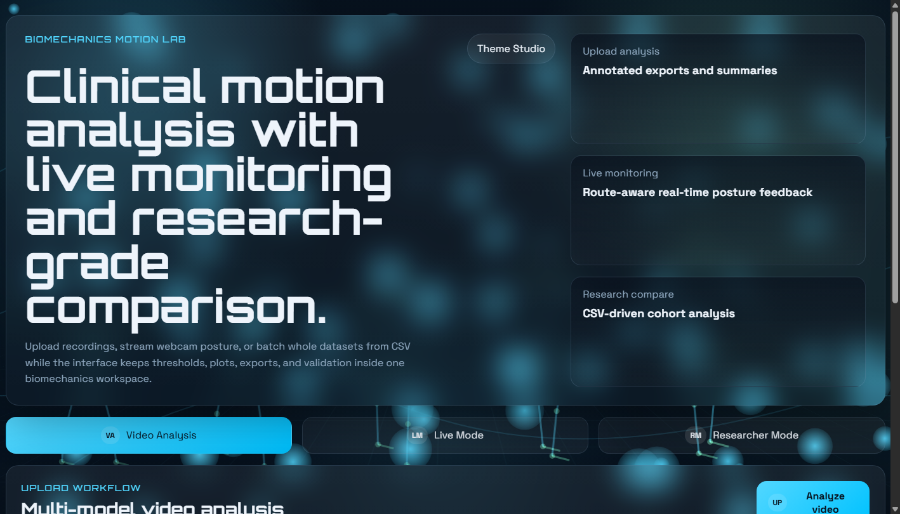
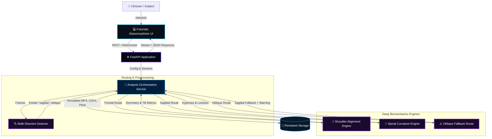
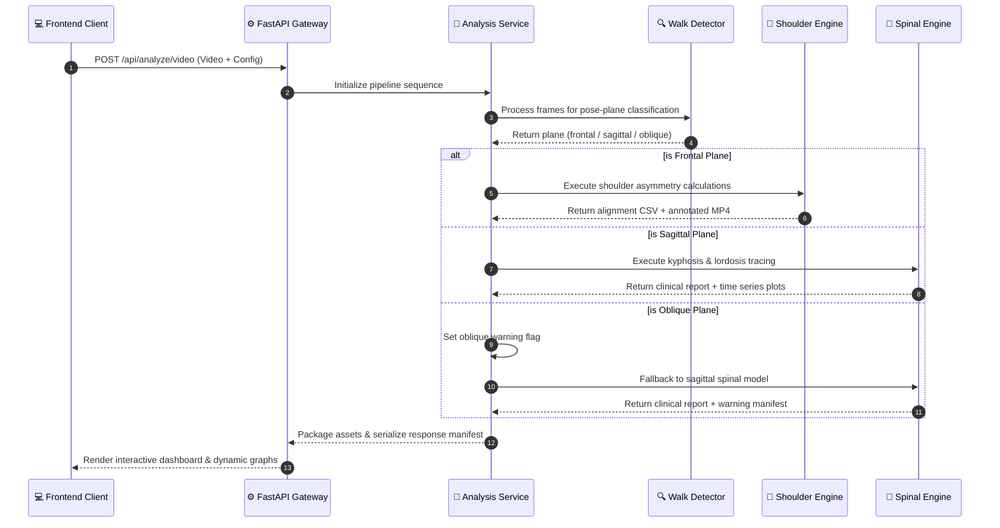

# 🧬 Biomechanics Posture Analysis
> **State-of-the-Art Motion Capture, Spinal Curvature, and Real-Time Kinematic Analysis Engine**

[](https://fastapi.tiangolo.com)
[](https://reactjs.org)
[](https://tailwindcss.com)
[](https://mediapipe.dev)
[](https://github.com/maryamkhalid-06/biomechanics-posture-analysis)

---

## 🌌 Overview

Welcome to the future of clinical biomechanics and kinetic analysis. **Biomechanics Posture Analysis** is a professional-grade, high-fidelity application designed to analyze, assess, and visualize human posture in real-time, from single videos, or across high-throughput clinical datasets.

Powered by a cutting-edge **FastAPI** backend, **MediaPipe**, and the custom **SpinePose AI** engine, the platform processes video feeds to extract precise joint angles, spinal curvature, and gait routing flags. All of this is visualized via a stunning **glassmorphism web interface** featuring smooth, interactive particle networks, real-time chart overlays, and reactive metrics.

---

## 🚀 Workflows

### 🎥 1. Video Analysis
Upload clinical videos and get instant, annotated outputs. The system automatically classifies the subject's walking plane (`frontal`, `sagittal`, or `oblique`) and routes the video to the appropriate biomechanics analysis engine.
* **Frontal Plane Routing**: Detailed shoulder alignment, clavicle tilt, and symmetry analysis.
* **Sagittal Plane Routing**: Spinal curvature reports detailing Lordosis, Kyphosis, and trunk lean metrics.

### ⚡ 2. Live Mode (WebSocket)
Stream high-speed webcam frames to the backend over a persistent WebSocket connection. Receive sub-millisecond annotated posture frames and immediate angle alerts, fully customized with real-time threshold indicators.

### 🧪 3. Researcher Mode
Batch process whole study cohorts with high-throughput CSV processing. Upload a CSV specifying multiple video sources, watch the progress bar update in real-time, and download a unified clinical manifest detailing per-subject statistical averages.

---

## 🔮 Interface Showcase

### 🖥️ High-Tech Dashboard (Initial View)
A premium dark-themed cybernetic control panel equipped with dynamic ambient glow lines, interactive upload zones, and model parameter tuners.


### 📊 Deep Kinematic Diagnostics (Analysis Results)
Comprehensive, multi-axis visual charts rendering shoulder symmetry, joint tilt matrices, and complete coordinate path traces.

### 👁️ Real-Time Live Feed (Webcam Analysis)
Super-low latency pose estimation stream using continuous WebSockets to track, overlay, and plot active skeletal vectors.

### 🧬 High-Throughput Cohort Analysis (Researcher Suite)
A professional research module for queueing large directories of patient videos and compiling structured batch manifests.

---

## 🛠️ System Architecture

Our high-throughput routing engine guarantees that no matter what angle the video is shot from, the system detects the plane of movement and processes the correct biological indicators.


```mermaid
flowchart TB
    %% Styling Definitions
    classDef browser fill:#0B0F19,stroke:#00C8FF,stroke-width:2px,color:#fff;
    classDef fastapi fill:#050816,stroke:#7C3AED,stroke-width:2px,color:#fff;
    classDef service fill:#001F3F,stroke:#00C8FF,stroke-width:1px,color:#fff;
    classDef engine fill:#1A0B2E,stroke:#9333EA,stroke-width:2px,color:#fff;
    classDef storage fill:#071A2B,stroke:#38BDF8,stroke-width:1px,color:#fff;

    %% Nodes
    U[👤 Clinician / Subject] -->|Interacts| F[💻 Futuristic Glassmorphism UI]
    F -->|REST / WebSocket| A[⚙️ FastAPI Application]
    A -->|Config & Streams| S[🧠 Analysis Orchestration Service]
    
    subgraph Routing & Preprocessing
        S -->|Frames| WD[🔍 Walk Direction Detector]
        WD -->|frontal / sagittal / oblique| S
    end

    subgraph Deep Biomechanics Engines
        S -->|Frontal Route| SE[📐 Shoulder Alignment Engine]
        S -->|Sagittal Route| PE[🦴 Spinal Curvature Engine]
        S -->|Oblique Route| OB[⚠️ Oblique Fallback Route]
    end

    %% Routing connections
    SE -->|Symmetry & Tilt Metrics| S
    PE -->|Kyphosis & Lordosis| S
    OB -->|Sagittal Fallback + Warning| S

    %% Storage & Manifest Output
    S -->|Annotated MP4, CSVs, Plots| DB[(📁 Persistent Storage)]
    A -->|Stream / JSON Response| F
    
    class F browser;
    class A fastapi;
    class S service;
    class WD,SE,PE,OB engine;
    class DB storage;
```

### 🔁 Request Pipeline Flow


```mermaid
sequenceDiagram
    autonumber
    participant Browser as 💻 Frontend Client
    participant API as ⚙️ FastAPI Gateway
    participant Orchestrator as 🧠 Analysis Service
    participant Detector as 🔍 Walk Detector
    participant Shoulder as 📐 Shoulder Engine
    participant Spinal as 🦴 Spinal Engine

    Browser->>API: POST /api/analyze/video (Video + Config)
    API->>Orchestrator: Initialize pipeline sequence
    Orchestrator->>Detector: Process frames for pose-plane classification
    Detector-->>Orchestrator: Return plane (frontal / sagittal / oblique)
    
    alt is Frontal Plane
        Orchestrator->>Shoulder: Execute shoulder asymmetry calculations
        Shoulder-->>Orchestrator: Return alignment CSV + annotated MP4
    else is Sagittal Plane
        Orchestrator->>Spinal: Execute kyphosis & lordosis tracing
        Spinal-->>Orchestrator: Return clinical report + time series plots
    else is Oblique Plane
        Orchestrator->>Orchestrator: Set oblique warning flag
        Orchestrator->>Spinal: Fallback to sagittal spinal model
        Spinal-->>Orchestrator: Return clinical report + warning manifest
    end
    
    Orchestrator-->>API: Package assets & serialize response manifest
    API-->>Browser: Render interactive dashboard & dynamic graphs
```

---

## ⚡ Technical Core Features

- **Robust Computer Vision Pipeline**: Pure Python execution optimized with OpenCV, NumPy, MediaPipe, and SpinePose.
- **Bi-directional WebSockets**: Live data streaming with high frame rates (FPS) and low round-trip latency.
- **Intelligent Fallback Routing**: Live walk classifier handles lateral, forward, and diagonal posture streams without breaking execution.
- **Comprehensive Clinical Reports**: Automatic export of patient joint angles (`.csv`), matplotlib-generated symmetry charts (`.png`), annotated diagnostic videos (`.mp4`), and summary reports.
- **All-In-One Portability**: Zero complex database configurations. Runs entirely on your local machine with an optional Cloudflare proxy hook.

---

## ⚙️ Setup & Installation

### Prerequisites
* **Python 3.10 / 3.11** (recommended)
* **Node.js 18+** (for frontend development & asset building)
* **SpinePose AI** package installed in your environment

### 1. Clone & Environment Preparation
```powershell
# Clone the repository
git clone https://github.com/maryamkhalid-06/biomechanics-posture-analysis.git
cd biomechanics-posture-analysis

# Initialize Virtual Environment
python -m venv .venv
.venv\Scripts\Activate.ps1
```

### 2. Install Dependencies
```powershell
# Install backend requirements
pip install -r requirements.txt

# Install frontend requirements
cd frontend
npm install
cd ..
```

---

## 🏃 Running the Application

### Option A: Local All-in-One Dev (Fastest)
The backend is designed to automatically serve the frontend files! Simply run:
```powershell
python run_backend.py
```
Then navigate your browser to:
👉 **[http://127.0.0.1:8000](http://127.0.0.1:8000)**

---

### Option B: Cloudflare Tunnel (Expose Online Instantly)
Want to share the clinical app or run it on another device without complex cloud deployments? Expose your local machine securely:
```powershell
.\start_online.ps1
```
*Copies the generated public link (`trycloudflare.com`) from your console and opens it on any device.*

---

### Option C: Isolated Split Development Mode
For developers who want to modify the React dependencies and use Vite's HMR (Hot Module Replacement):
1. **Start backend**:
   ```powershell
   python run_backend.py
   ```
2. **Start Vite server** (in a separate terminal):
   ```powershell
   cd frontend
   npm run dev
   ```
   *The Vite proxy will route all backend requests (`/api`, `/ws`, `/files`) straight to `localhost:8000` automatically.*

---

## 📂 Project Blueprint

```text
biomechanics posture analysis/
├── backend/
│   └── app/
│       ├── main.py                  # FastAPI Gateway Server
│       ├── analysis_service.py      # Core routing and pipeline manager
│       └── __init__.py
├── backend_storage/                 # Active file storage
│   ├── results/                     # Diagnostic reports & charts
│   └── uploads/                     # Cached video files
├── docs/
│   └── screenshots/                 # Futuristic UI images
├── frontend/
│   ├── index.html                   # HTML entry skeleton
│   ├── app.html                     # Dashboard layout template
│   ├── src/
│   │   ├── app.js                   # Main dashboard engine (charts, websocket, theming)
│   │   ├── styles.css               # Futuristic cybernetic design style
│   │   └── main.jsx                 # Legacy React scaffolding
│   ├── package.json                 # Node dependencies
│   ├── research-template.csv        # Researcher upload guide
│   └── vite.config.js               # Frontend bundler settings
├── requirements.txt                 # Core python dependencies
├── run_backend.py                   # Server starter script
├── shoulderaigment.py               # Shoulder frontal-plane analyzer
├── spinal_analysis_complete.py      # Spinal sagittal-plane clinical analyzer
├── walk_direction_detector.py       # Pose classification engine
└── README.md                        # Project documentation
```

---

## 🗺️ Future Expansion Plan

1. **Native React Transition**: Fully port the core rendering modules from `app.js` to modular React hook structures.
2. **GPU Acceleration Support**: Build optional Dockerized execution parameters with CUDA enablement.
3. **Advanced Biomechanical Diagnostics**: Expand kinematics tracing to include knee flexion, heel strike, and foot rotation profiles.
4. **Cloud-Native Storage Hook**: Offer direct S3/MinIO connectors to decouple generated files from the server's disk space.

---

*Developed with 💙 for advanced human motion analysis and sports science.*
